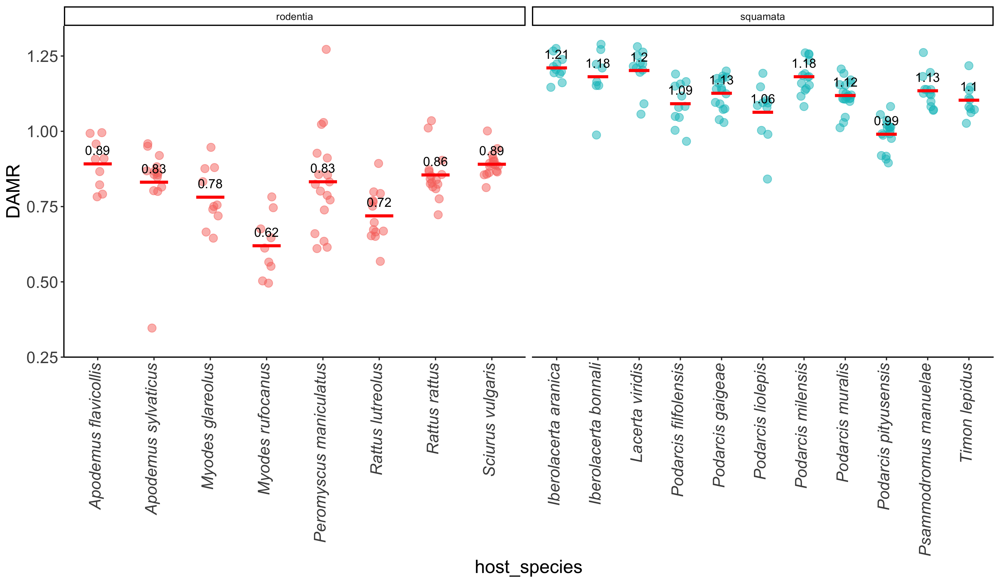

# 0_host_species_representation
Raphael Eisenhofer

- [Representativeness of the different host
  metagenomes](#representativeness-of-the-different-host-metagenomes)
- [DAMR estimates by host order and
  species](#damr-estimates-by-host-order-and-species)

## Representativeness of the different host metagenomes

We have 20 different host taxa, 11 are squamates, 9 are rodents.

How well represented are the host orders by metagenomic data and number
of MAGs?

``` r
set.seed(1337)

coassembly_df %>%
  ggplot(aes(x = host_order, y = n_mags, 
             colour = host_order, label = paste(host, n_samples))) +
  geom_jitter(height = 0, width = 0.1, alpha = 0.6, 
              aes(size = metagenomic_data_gbp)) + 
  geom_text_repel() + 
  theme_classic() +
  theme(axis.title = element_text(size = 16),
        axis.text = element_text(size = 14))
```


## DAMR estimates by host order and species

Determining how representative the MAGs are of each host species using
the Domain-Adjusted Mapping Rate (DAMR).

``` r
#Select the right view id
view <- airtable(base = 'appWbHBNLE6iAsMRV',
                 table = 'tblWDyQmM9rQ9wq57',
                 view = 'viwQ4Ow667d1lqFpf')

#wrangle
airtable_data_dmb <- read_airtable(view, 
                               id_to_col = TRUE, 
                               max_rows = 50000) %>%
  filter(DM_batch_static == "DMB0173") %>%
  select(EHI_sample_static, MAG_mapping_percentage,
         SingleM_fraction, host_species) %>%
  mutate(SingleM_fraction = as.numeric(SingleM_fraction),
         host_species = as.character(host_species),
         DAMR = MAG_mapping_percentage / SingleM_fraction) %>%
  inner_join(., coassembly_df, by = join_by(host_species == host))

#plot
airtable_data_dmb %>%
  filter(EHI_sample_static != "EHI01045" & EHI_sample_static != "EHI01812") %>%
  ggplot(aes(x = host_species, y = DAMR, 
             colour = host_order, label = host_species)) +
  geom_jitter(
    size = 3, 
    height = 0, 
    width = 0.15, 
    alpha = 0.5
  ) +
  facet_nested(~host_order, scale = "free") +
  stat_summary(
    fun = "mean", 
    geom = "crossbar", 
    colour = "red", 
    width = 0.5
  ) +
  stat_summary(
    fun = "mean",
    geom = "text",
    aes(label = round(..y.., 2)),
    vjust = -1,
    colour = "black"
  ) +
  scale_y_continuous(limits = c(0.3, 1.3)) +
  theme_classic() +
  theme(
    axis.text = element_text(size = 14),
    axis.title = element_text(size = 16),
    axis.text.x = element_text(angle = 90, face = "italic",
                               hjust = 1, vjust = 0.25),
    legend.position = "none"
    )
```



Note I’ve filtered out both EHI01045 (no SMF value) and EHI01812 (only
0.16% mapping).
