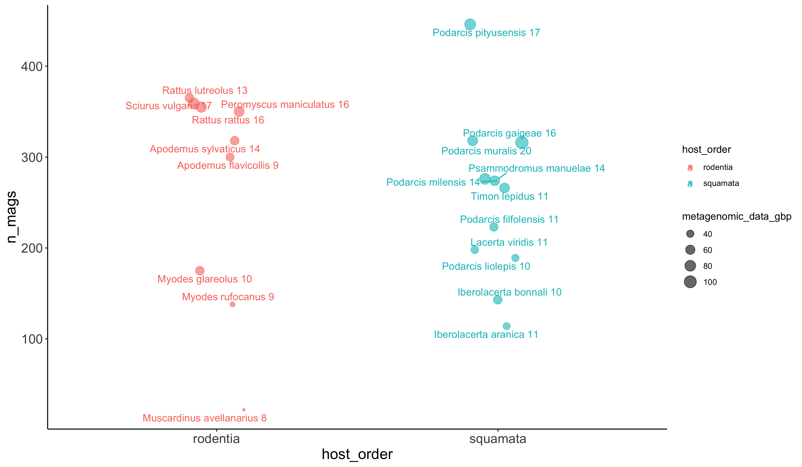

# 0_host_species_representation
Raphael Eisenhofer

- [Representativeness of the different host
  metagenomes](#representativeness-of-the-different-host-metagenomes)

## Representativeness of the different host metagenomes

We have 20 different host taxa, 11 are squamates, 9 are rodents.

How well represented are the host orders by metagenomic data and number
of MAGs?

``` r
set.seed(1337)

df %>%
  ggplot(aes(x = host_order, y = n_mags, 
             colour = host_order, label = paste(host, n_samples))) +
  geom_jitter(height = 0, width = 0.1, alpha = 0.6, 
              aes(size = metagenomic_data_gbp)) + 
  geom_text_repel() + 
  theme_classic() +
  theme(axis.title = element_text(size = 16),
        axis.text = element_text(size = 14))
```


